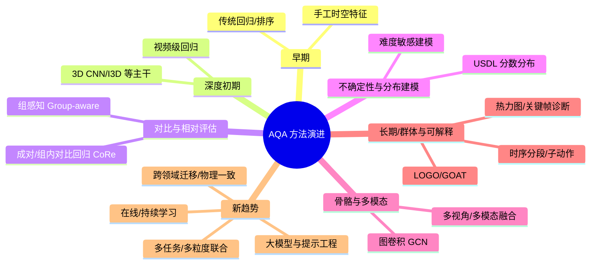

## 一句话概览
AQA 是“把一段动作做得多好”自动打分/排序的问题。在体育场景里，它已经从早期的“手工特征+浅层模型”发展到现在的“3D CNN/Transformer + 骨骼/多模态 + 相对/分布/可解释评估”，并在跳水、花样滑冰、艺术体操、长视频群体项目等方向有了较成熟的基准和系统级应用，同时正向多模态、大模型、长期/在线评估和跨领域迁移拓展。近年的综述（2024–2025）对 150+ 篇论文做了系统分类和统一基准评测，并总结了若干趋势和开放问题。
---
## 一、问题定义与基本设定
1. 形式化  
   - 输入：视频（或骨骼序列/多视角/多模态信号）。  
   - 输出：
     - “绝对分”（回归）：预测一个与裁判打分相关的标量或分布；
     - “相对分/排序”（排序/对比）：在同组视频内做相对高低排序；
     - “细粒度诊断”：识别子动作质量、错误类型或关键帧。  
   - 典型损失：回归 MSE/Huber、排序损失/成对对比、分布损失（如 USDL）、分组分类+区间回归等。
2. 与相关任务的边界  
   - 动作识别：“做什么动作”（类别）；  
   - AQA：“做得怎样”（质量/难度/完成度/艺术表现等）。因此 AQA 需要更敏感的细粒度建模和评分一致性建模。
---
## 二、典型体育 AQA 数据集（以运动为主）
| 数据集 | 运动类型/模态 | 主要特点（与 AQA 相关） |
|--------|--------------|--------------------------|
| MIT Diving、UNLV-Dive、AQA-7 | 跳水（单视角） | 早期裁判分+难度，用于验证“对比回归”“不确定性分布学习”等 |
| MTL-AQA | 跳水；多任务（细粒度动作识别、文字评论生成、AQA 分数） | 样本量较大（1600+），标注多任务，成为近年常用基准 |
| FineDiving、FineGym（体操） | 跳水/体操；更细粒度 | 提供动作阶段/难度等细粒度标注，强调阶段质量评估 |
| LOGO | 艺术游泳（集体、长视频、多视角） | 多人、长视频、逐帧动作/队形标注，首推群体 AQA 与长期建模 |
| MMFS | 花样滑冰（多模态：多机位+音乐） | 支持多模态与多任务（质量评分、音乐与动作匹配等） |
- 更全面的列表与统计可见 2024–2025 的“Comprehensive Survey of AQA”与“A Decade of AQA”等综述。
---
## 三、方法演进脉络（尤其体育类）
### 3.1 发展阶段概览（按思路）

### 3.2 早期：从手工特征到浅层模型
- 代表性工作：Gordon 等最早提出“对人类表现的视频自动评估”思想。  
- 方法：使用 iDT、轨迹/光流等手工特征 + SVM/核回归等；  
- 不足：对复杂体育项目（跳水、体操、滑冰）的细粒度差异建模能力有限。
### 3.3 深度学习阶段：3D CNN 与视频级特征
- 主干：I3D、SlowFast、C3D 等视频主干被广泛用于端到端回归。  
- 典型任务：跳水、体操、滑冰的裁判分数回归；  
- 优点：端到端可训练，表征能力显著提升；  
- 不足：对细粒度时序结构利用不够，对“难度”“艺术表现”等隐性因素难以显式建模。
### 3.4 对比/相对评估：CoRe 与 Group-aware
- CoRe（Contrastive Regression，ICCV 2021）：通过成对比较视频之间的“相对分”，构建对比回归目标，突出差异，显著提升 AQA-7、MTL-AQA、JIGSAWS 等指标。  
- Group-aware Contrastive Regression：将样本按难度/类别分组，先做组分类再在组内做相对回归，缓解难度与质量耦合问题。
- 意义：把 AQA 从“绝对分回归”扩展到“相对排序+对比学习”，使模型更关注“微弱质量差异”。
### 3.5 不确定性与分布建模：USDL 等
- USDL（Uncertainty-aware Score Distribution Learning，CVPR 2020）：将每个动作视为一个分数“分布”而非单点值，引入不确定性建模。  
- 好处：更贴合多裁判/主观评分场景，提高鲁棒性，尤其在跳水等裁判打分噪声较大的项目上效果明显。
### 3.6 时序结构建模：自注意力、分段与 Tube Self-Attention
- Temporal Parsing Transformer（ECCV 2022）：使用可学习 query 把视频切分为多个“子动作/时间段”表示，并结合排序与稀疏损失约束时序顺序，再做“分段感知对比回归”。  
- TSA-Net（ACM MM 2021）：引入“管状自注意力”（Tube Self-Attention），在 3D 时空中捕捉单目标的长期依赖，并在 FineDiving、MTL-AQA、AQA-7 上验证有效性。  
- 这类方法更贴合体育项目“助跑—起跳—空中动作—入水/落地”等阶段性结构。
### 3.7 骨骼与图结构：GCN 与姿态回归
- 利用人体骨架图进行图卷积（GCN），可在运动捕捉/关键点条件下做更可解释、更稳定的 AQA（尤其健身/康复类动作）。  
- 体育场景：
  - 体操/跳水：用关节角度、身体姿态变化评估翻转、转体、身体姿态控制；
  - 健身/训练：动作标准度、发力方式、关节角度轨迹等。  
- 优点：模型更轻、对背景/服装鲁棒；不足：依赖高质量姿态估计或动捕设备。
### 3.8 多视角与多模态（音乐、雷达、IMU 等）
- LOGO 数据集展示多机位+队形标注在艺术游泳 AQA 的潜力。  
- MMFS（花样滑冰）把音乐节拍、编舞与视频联合建模。  
- 2024–2025 的综述总结多模态 AQA 的典型架构，强调音视频对齐、多视角融合、节奏与质量关联等。
### 3.9 长期与群体动作评估（LOGO、GOAT 等）
- LOGO 提出长视频群体 AQA 任务，并给出 GOAT 模块，用于建模多人间的协同关系和长期时序结构。  
- 核心难点：
  - 动作得分可能受视频后半段失误的严重影响（时间依赖）；
  - 多人“队形/协同质量”难以用简单视频级特征刻画。  
- 长视频 AQA 的研究还有 Doughty 等针对长视频技能评估的时序注意力建模。
### 3.10 可解释与“细粒度推理”
- 通过：
  - 时序解析/分段（Temporal Parsing）提供子动作级注意力图；
  - 热力图/关键帧提示（如 TSA-Net 的“管状注意力”）；
  - 与规则/评分量表（rubric）对齐的输出，例如 RICA2 将评分标准显式纳入评估。  
- 目标：不仅给出总分，还能指出“哪里扣分、为何扣分”，利于教练与运动员使用。
---
## 四、评价指标与系统性能水平
- 常用指标：SRCC（Spearman 秩相关系数）、R²（决定系数）、RMSE（均方根误差）；部分工作还报告准确率（离散化后）和运行效率（FLOPs、延迟）。  
- 性能趋势（以跳水/体操类主流数据集为例）：
  - 相对评估方法（CoRe、Group-aware）普遍优于纯绝对回归；
  - 不确定性/分布方法在裁判噪声较大时表现更稳；
  - 在 MTL-AQA、FineDiving、AQA-7 上，SRCC 已普遍达到 0.9 量级，但在难分样本和跨项目/跨裁判迁移场景仍有下降。  
- 2024 的统一基准对 150+ 篇论文在多数据集上做了精度与计算效率对比，并指出“精度-效率权衡”是未来系统部署的重要考量。
---
## 五、研究热点与前沿方向（体育/运动视角）
1) 多任务与多粒度联合  
   - 同时做动作识别、难度估计、质量评分、文字评论生成（如 MTL-AQA）；  
   - 综述强调这是提升数据利用率、促进共享表征的关键方向。
2) 多模态 AQA  
   - 视频+音乐（花样滑冰）、多机位（艺术体操/游泳）、雷达/IMU（室外运动）等；  
   - 2024–2025 统计显示“多模态 AQA”论文数量快速增长。
3) 可解释与规则对齐  
   - 将评分标准（rubric）和裁判细则显式编码到模型中，提高对裁判打分逻辑的贴合度；  
   - 通过时序分段与关键帧可视化，为教练与运动员提供“诊断性反馈”。
4) 长期/在线与持续学习  
   - 长视频/赛事级评分：如何有效建模前序失误对最终分数的影响；  
   - 赛季/规则变化时的模型更新：避免灾难性遗忘，保持对旧项目的兼容。
5) 跨项目/跨域迁移与泛化  
   - 从“跳水/体操”迁移到其他项目（田径、球类、冰雪运动）或工业/医疗操作；  
   - 利用大模型/多模态基座做少样本 AQA，是当前重点探索方向。
6) 物理一致与仿真增强  
   - 将人体动力学、运动学约束引入 AQA（例如身体质心轨迹、角动量守恒）；  
   - 仿真/合成数据增强，弥补真实比赛数据的稀缺（尤其是高危/高难度动作）。
---
## 六、典型应用场景（体育侧）
- 比赛辅助评分与裁判复核：  
  为裁判提供第二意见，减少主观偏差；对争议动作进行回放+定量评估。
- 训练反馈与技战术分析：  
  对比个人/团队的多轮训练，识别稳定性、完成度和风险点。
- 转播与智能解说：  
  为解说提供“量化亮点”“技术失误点”的自动摘要与可视化。
- 青训与大众健身：  
  面向动作标准化、安全性、训练负荷的自动评估和纠错提示。
---
## 七、进一步阅读建议
- 综述与榜单（2024–2025，覆盖面广、含统一基准）：  
  - “A Comprehensive Survey of Action Quality Assessment: Method and Benchmark”（项目页含数据集/方法统计、统一评测）。  
  - “A Decade of Action Quality Assessment”（IJCV，聚焦近十年演进）。
- 代表性工作（体育为主）：  
  - CoRe/Group-aware 对比回归；USDL 不确定性分布；  
  - Temporal Parsing Transformer；TSA-Net（管状自注意力）；  
  - LOGO 与 GOAT（长视频群体 AQA）；  
  - MMFS（多模态花样滑冰）；  
  - RICA2（Rubric-Informed、校准化 AQA）。
如果你有特定的运动项目（比如“跳水/体操/花样滑冰/健身/球类”）或具体任务（实时打分、离线复盘、姿态+视频联合评估等）可以告诉我，我可以按项目/任务帮你整理更细的技术路线、可用数据集与建模要点。
