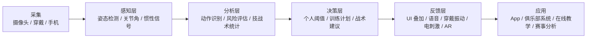

## 一、结论先说在前面
- “AI 辅助运动”已经从实验室走向大规模应用：  
  - 市场端：2023–2028 年全球“AI in Sports”市场预计增加约 64 亿美元，年复合增速约 33.13%。  
  - 技术端：核心是“深度学习 + 姿态估计 / 动作识别”，支持实时反馈、动作纠正、自动化战术与判罚辅助等。
- 主流形态：  
  1）手机/摄像头 + App 的“大众版”AI 教练；  
  2）多摄像头 + 专业系统的“实验室/俱乐部版”；  
  3）穿戴/IMU + 视觉融合的“多模态系统”。  
- 主要痛点：数据集多为“私有且不开放”、缺乏长期追踪研究、从实验室到真实场景的鲁棒性不足。
下面按“市场产品 – 典型场景 – 最新科研 – 产业链 & 趋势”来讲。
---
## 二、整体发展现状：从“能看”到“能教”
1. 市场规模与增长  
   - Technavio：AI in Sports 市场规模预计 2023–2028 期间增加约 64.2 亿美元，CAGR≈33.13%。  
   - 应用方向包括：运动员表现分析、伤病预防、技战术分析、粉丝互动与内容生成等。
2. 技术底座：人体姿态估计（HPE）与动作识别  
   - 2025 年的系统综述把“深度学习人体姿态估计在体育中的应用”归纳为四大类：  
     1）运动技能分析（movement skill analysis）；  
     2）动作识别（action recognition）；  
     3）增强教练工具（augmented coaching tools）；  
     4）辅助判罚（officiating support）。  
   - 主流技术栈：2D/3D 关键点检测 + 时序模型（RNN/Transformer）+ 骨架动作识别；多模态（RGB+IMU）方案在逐步增多。
3. 应用形态  
   - 大众健身 & 舞蹈：手机前置摄像头 + App，实时姿态评估 + 动作计数 + 语音/可视化反馈。  
   - 球类 & 搏击：多机位/云分析，技术统计 + 投篮/挥拍/出拳动作自动识别与反馈。  
   - 专业队：视频分析平台 + 数据仪表盘，多运动员、多场次对比与战术建模。
---
## 三、典型产品与解决方案
### 1. 球类：从“能算分”到“能纠动作”
- HomeCourt（篮球）  
  - 通过手机摄像头 + AI，实时分析投篮动作：出手时间、出手角度、弹道、腿部角度等，并给出统计数据与反馈，无需额外硬件。  
  - 底层使用深度学习进行目标检测与跟踪，实现“单手机 + AI”的专业级投篮分析体验。
- 其他球类（羽毛球、网球、足球等）  
  - 多数采用类似逻辑：关键点检测 → 挥拍/击球/步态动作识别 → 与模板对比 → 反馈与统计。  
  - 学术/开源侧有类似 Sports2D 这类工具，可从视频中自动计算 2D 关节角度与运动学指标，用于技术分析与康复评估。
### 2. 舞蹈：动作分类 + 相似度匹配 + 分段纠错
- 斯坦福 CS231N 课程项目（AI 舞蹈教练）  
  - 使用 MoveNet 提取 17 个关键点，做躯干归一化；  
  - ViT/Transformer 对滑窗帧序列做“芭蕾舞步分类”；  
  - 通过 DTW（Dynamic Time Warping）将用户片段与参考动作对齐，给出时间轴级别的匹配与反馈；  
  - 再结合 LLM（如 Gemini）生成自然语言指导。  
  - 实验显示：在视频帧级别整体准确率约 68%，动作类别分类准确率约 82%。
- PoseAI 等商业/早期项目  
  - 面向舞蹈的“姿势实时分析与纠正”，通过普通摄像头提取骨骼关键点，对比标准姿势并给出实时反馈。
### 3. 健身 & 康复：深蹲、硬拉等动作的“智能镜/手机教练”
- 典型系统（YOLOv8-Pose 等）  
  - 使用 YOLOv8-Pose 检测 17 个关键点，针对深蹲、俯卧撑、引体向上、侧平举等动作：  
    - 实时计算关节角度（如膝角、肘角）；  
    - 与“标准动作”视频进行骨架对齐与相似度打分（0–100 分）；  
    - 自动计数与错误识别（左右不对称、角度不足等），并给出纠正建议。  
  - 实验中动作计数准确率 >95%，与教练评估高度相关。
- 工程实践（MediaPipe / TFLite 部署）  
  - 对比 OpenPose / MediaPipe / MMPose 后，很多团队选择 MediaPipe，因为它在 PC 上可 >30FPS，支持移动端端到端部署，适合“手机 + AI 教练”场景。  
  - 通过 TFLite 量化（FP16/INT8）和多线程流水线，把延迟压到 <50ms，实现实时反馈。
- Keep 等国内 App  
  - “体态评估”：通过正面/侧面照片识别关键点，生成体态问题报告，并推荐针对性训练课程。  
  - “AI 运动教练”：结合运动算法、大数据和实时语音指导，对多种健身项目提供动作纠正建议。
### 4. 武术 & 搏击：动作识别与战术分析
- 搏击（拳击）  
  - BoxingVI：面向拳击的大型多模态数据集，包含 6915 段精细分割的出拳片段（6 类拳法），附带 2D 骨骼和时间段标注，用于动作识别/定位、自动教练与表现评估。  
  - 强调在“低资源、非受控环境”下，用纯视觉做动作分析与技术统计，减少对昂贵穿戴传感器的依赖。
- 武术/套路  
  - 传统武术动作识别研究：基于 OpenPose 的骨骼提取 + 分类网络，提高套路的自动识别精度，用于辅助教学与评分。  
  - 跆拳道单位动作识别：使用 IMU 关节运动数据，通过深度学习识别跆拳道基本动作，为训练与考核提供量化依据。
---
## 四、最新科研方向与代表性成果
### 1. 人体姿态估计（HPE）与体育：系统综述
- 2025 年 Sports Med Open 的系统综述：  
  - 把应用分为：运动技能分析、动作识别、增强教练工具、辅助判罚四大类。  
  - 指出：  
    - 多数研究使用私有数据集，开放、标准化的体育专用数据集不足，影响可复现性和推广；  
    - 缺乏“长期训练干预”的实证研究，难以证明这些工具真正能带来长期成绩提升。
### 2. 深度学习动作识别与姿态估计（综述）
- 2024–2025 年多篇综述（如 ACM Computing Surveys 等）总结：  
  - 从 2D/3D 关键点检测、多视角重建到时序建模（RNN/3D-CNN/Transformer），整体趋势是：  
    - 更轻量化模型（Edge/移动端部署）；  
    - 更强遮挡/复杂背景下的鲁棒性；  
    - 多模态融合（RGB + 深度 + IMU/EMG）。
### 3. 舞蹈 & 多样化动作的 AI 教练
- CS231N 舞蹈教练项目：  
  - 完整展示了“MoveNet 姿态提取 → Transformer 动作分类 → DTW 时间对齐 → LLM 反馈”的工程化流程，说明从“能识别动作”到“能给出教学建议”的路径已经打通。  
- 其他研究：  
  - SyncUp 等系统通过姿态相似度和时间同步的可视化，帮助舞者练习与团队编排。  
  - SYD-Net 在体育/瑜伽/舞蹈图像上，通过 patch-based attention 的 CNN 提升识别准确率。
### 4. 球类 & 搏击的细粒度动作识别
- BoxingVI 数据集：  
  - 解决“搏击类运动细粒度动作数据稀缺”的问题，为拳击动作识别和自动教练提供公开基准。  
- 通用球类/战术分析：  
  - 大量工作集中在球员/球跟踪、战术空间分析和自动战术报告生成，是“AI 辅助运动”的重要组成部分（尽管更偏团队/战术层面）。
### 5. 多模态系统 & “AI + 生物力学 + 穿戴”
- 最新专利与工程方案：  
  - 多模态感知：多摄像头阵列（RGB + 红外 + 双目深度） + IMU/EMG/压力传感器，实时采集关节角度、肌电、力线等信息；  
  - 通过注意力机制做特征融合，再用迁移学习/元学习适配不同用户；  
  - 用生物力学模型计算关节负荷、肌肉激活度，生成个性化安全阈值与反馈（包括电刺激、AR 叠加轨迹、语音预警等）。
---
## 五、按运动形态看：AI 辅助运动在各类项目中的落地情况
| 运动形态 | 典型场景 | AI 技术方案 | 成熟度 |
|---------|----------|-------------|--------|
| 球类（篮球/足球/羽毛球/网球等） | 投篮/射门/挥拍动作纠错、战术空间分析 | RGB/多机位姿态跟踪 + 行为识别 + 统计分析 | 商业化较成熟（如 HomeCourt 等）；俱乐部/赛事侧数据分析平台普遍 |
| 舞蹈/艺术体操 | 舞步识别、与参考动作的时间/空间对齐、风格评估 | 关键点检测 + 时序 Transformer + DTW + LLM 反馈 | 科研与原型产品丰富，商业落地中（舞蹈教室/在线教学） |
| 武术/搏击 | 套路识别、出拳分类、战术分析、自动评分 | 骨架动作识别 + 细粒度类别（如 6 类拳法） + 多模态融合 | 数据集与算法快速补齐，应用以“分析系统 + 教练辅助工具”为主 |
| 健身/康复 | 深蹲/硬拉/俯卧撑等动作计数、关节角度评估、姿势纠错 | YOLOv8-Pose / MediaPipe + 角度阈值 + 相似度打分 | 商业化程度高，大量 App/镜子产品已支持实时姿态评估 |
---
## 六、产业链 & 技术栈（简图）
下面是一个典型的“AI 辅助运动”系统链路，从采集到反馈：

---
## 七、关键趋势与痛点
### 趋势
1. 从“单一指标”到“动作质量 + 伤病风险 + 战术”一体化  
   - 不只是步数/距离，而是关节角度、发力链、对称性、落地冲击等，与运动表现和伤病预防直接挂钩。
2. 端侧 AI + 云端分析混合  
   - 手机/摄像头做轻量推理（MediaPipe/YOLOv8-Pose 等），云端做复杂模型（多视角 3D 重建、大模型反馈）。
3. 多模态融合  
   - 视觉 + IMU/EMG/压力 + 环境信息，提升在遮挡、快速运动下的鲁棒性，并支撑更精细的生物力学分析。
4. LLM / 生成式 AI 作为“教练话术层”  
   - 将量化偏差（角度/时序/轨迹）转化为自然语言指导，正在成为新的产品形态（如舞蹈教练项目中的 Gemini 推荐模块）。
### 痛点
1. 数据与可复现性  
   - 多数研究使用私有数据集，缺乏开放、标注丰富的体育专用数据集，导致算法难以对比与迁移。
2. 从实验室到现实场景的 Gap  
   - 遮挡、多目标、复杂背景、服装/器械（球拍、拳套、器械）都会影响关键点检测与动作识别的稳定性。
3. 教学效果证据不足  
   - 很少有长期干预研究证明“用 AI 辅导”比传统教练在技能提升、伤病减少上有显著优势，教练和机构仍较谨慎。
4. 个体差异与安全性  
   - 年龄、伤病历史、柔韧性差异很大，统一的“角度阈值”可能不适用，需要更个性化的安全阈值与反馈策略。
---
## 八、如果你是从业者/研究者，可以关注什么？
- 产品侧：  
  - 选型：MediaPipe/YOLOv8-Pose 等轻量模型做 MVP，快速验证产品‑市场匹配；  
  - 差异化：把“姿态估计”真正做成“运动生物力学 + 训练科学的洞察层”，而不是只画骨架。
- 研究侧：  
  - 数据：建设高质量、开放标注的体育动作数据集（特别是舞蹈、武术、搏击等）；  
  - 评估：设计长期训练实验，量化“AI 辅助训练”对成绩和伤病的真实影响；  
  - 多模态：探索 RGB + IMU + EMG 的融合，提高复杂场景下的稳定性与信息维度。
如果你有特定运动（比如“芭蕾”“太极拳”“羽毛球”）想要更细的技术/产品方案，可以告诉我具体项目，我可以帮你拆成“传感器选型 + 模型 + 产品形态”的更具体设计。
