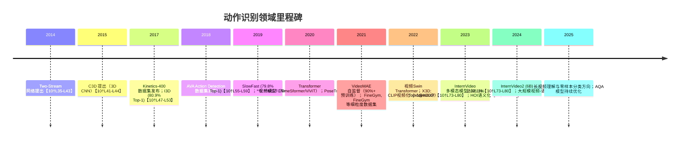

# 执行摘要

近三年（2023–2026）视频人类动作识别领域取得了显著进展，尤其是大规模预训练视频模型和多模态方法推动了准确率与泛化能力的提升。当前动作分类任务（例如Kinetics-400）Top-1准确率已超过92%【10†L75-L80】；细粒度动作分割任务（如GTEA、Breakfast）采用Transformer等模型可达80%+的F1分数【48†L1437-L1445】；2D/3D姿态估计的COCO基准上，最新模型（如ViTPose-G）AP可达80.9【18†L149-L158】。细粒度技能识别和动作评价（如花样滑冰、跳水）使用特制数据集进行训练，最新模型在**FineFS**等数据集上的相关性指标达到ρ≈0.96【36†L1-L4】。然而复杂动作（如花式足球）存在小目标、高速遮挡、细粒度差异大、标注稀缺和评分主观性高等难点【29†L561-L569】【55†L19-L24】。产业界已有多种开源工具（OpenPose、MediaPipe、MMPose等）和商业系统（体育分析软件、智能裁判系统）可用于动作识别，但在实时性、鲁棒性和场景适应上仍存在局限。研究趋势方面，大规模视频-语言模型、弱/自监督学习、多模态融合和合成数据等方向正成为热点。针对“花式足球细粒度技能识别/评分”项目建议分阶段实施：第一阶段聚焦数据（爬取/拍摄视频，结合骨架和物体标注）；第二阶段构建模型（融合RGB与姿态特征的多流网络）；第三阶段迭代优化（引入规则+学习混合策略、性能评估与用户反馈）。整体而言，该领域已从浅层CNN时代进入以Transformer和预训练大模型为特征的高速迭代阶段，未来将逐步向长视频理解和可解释评价方向发展。

# 关键结论

- **时序与历程**：自2014年起，动作识别从双流网络、3D CNN（C3D）发展到2017年I3D（Top-1@K400=80.9%【10†L49-L53】）、2019年SlowFast（Top-1@K400≈79.8%【10†L55-L59】），再到2021年引入Vision Transformer（TimeSformer/ViViT），2022年VideoMAE自监督预训练大幅提高数据利用率【10†L65-L74】；2023–2024年上海AI实验室的InternVideo系列凭借多模态大规模预训练推动Kinetics-400准确率达到91.1%–92.1%【10†L73-L80】。  
- **任务类别与模型**：当前研究覆盖2D/3D姿态估计、整体动作分类、时序动作分割、细粒度技能识别、人-物交互（HOI）、动作质量评估、动作对齐/模仿以及视频-语言多模态等。代表性模型包括：Pose估计领域的HRNet、ViTPose（Transformer骨干，COCO AP≈80.9【18†L149-L158】）、VideoPose3D等；动作分类领域的3D CNN（SlowFast、I3D）与时空Transformer（TimeSformer、VideoMAE、InternVideo系列）；时序分割领域的MS-TCN++、ASFormer、C2F-TCN等；HOI识别领域开始引入CLIP文本监督模型【31†L63-L72】；动作评分领域最新模型（如两流Mamba金字塔网络）在花样滑冰数据集上TES、PCS相关度达到0.80–0.96【36†L1-L4】；动作对齐/模仿学习尚属发展中，可借鉴机器人模仿学习和序列对齐技术。主要基准性能见表格对比。  
- **数据集与基准**：主流分类数据集包括Kinetics（400/600/700类，~30万视频）、Something-Something v2（主测时序理解）、UCF101/HMDB51（小规模老数据集），时空检测数据集有AVA、ActivityNet；骨骼姿态数据集有COCO Keypoints、PoseTrack（多帧跟踪）、Human3.6M（3D姿态，MPJPE SOTA≈13.4mm【22†L15-L23】）；细粒度技能数据集如FineGym（体操分级标注【43†L59-L67】）、FineDiving（3000个跳水视频【40†L607-L614】）、FineFS（花滑动作元素精确标注【34†L25-L33】）；尚无公开“花式足球”数据集。每个数据集的规模、标签类型和局限性总结见下表。

- **技术瓶颈**：复杂动作识别面临多重难点：**小目标与高速遮挡**（运动员和用具占比小、动作快速，导致传统网络难提取有效特征【29†L561-L569】）；**细粒度差异**（花式足球动作用球法、花样动作之间细微区分度低）；**时序依赖**（花式动作往往由多个连续技巧构成，需要模型长时序建模）；**标注稀缺与主观性**（花式技能评分具有主观性，不同裁判打分差异大【55†L19-L24】，同时现有数据不足以覆盖所有技巧）。这些问题导致当前模型对高度复杂动作的泛化能力有限。  
- **产业应用**：常用开源库有OpenPose、MediaPipe、MMPose（OpenMMLab）、Detectron2、DeepLabCut等，可用于实时姿态估计和骨架提取；商用系统方面，已有体育分析和智能裁判公司（如Sportlogiq、Nod.ai等）在比赛视频分析中应用动作识别技术，但多限于特定体育项目（篮球、足球事件识别）且多依赖简化假设。综上，现有技术在精准度和实时性之间仍需权衡，实际落地需考虑计算成本、标注投入和行业特定需求。  
- **研究趋势**：大规模预训练视频-语言模型（如InternVideo、VideoCLIP、Flutter等）是未来趋势，通过跨模态对齐提升模型泛化；**弱/自监督学习**（VideoMAE、CLIP Zero-shot）减少标注需求；**合成与仿真数据**（利用虚拟环境生成多样化训练样本）可缓解真实世界数据不足；**人-物交互专用模块**（集成对象检测和关系推理，以更好处理小物体和交互场景）；**可解释性与评分机制**（结合规则、动作语法提高对动作质量评价的透明度）。多模态融合和复合模型（视觉+文本+骨架）正逐步成为主流研究方向。  
- **建议路线图**：针对“花式足球细粒度技能识别/评分”项目，建议**分阶段推进**：**数据阶段**：收集多角度比赛/训练视频，利用OpenPose/MediaPipe生成2D骨架，结合自动或人工标注生成分段（技巧起止）、难度和评分数据；初级方案仅用少量标注视频（低资源），高级方案采用众包或仿真补充数据。**模型阶段**：首先尝试已有视频分类框架（如SlowFast、Video Swin、C2F-TCN）融合骨架特征（GNN或LSTM处理关节点序列）进行动作分类和分割；中期加入多模态（球、鞋等物体检测）和文本标签（动作用语描述），高端阶段可构建多头网络分别输出技能类别和评分。**评估阶段**：采用Top-1/Top-5 Accuracy（分类）、mAP（检测）、F1/Edit（分割）、PCK/MPJPE（姿态）等指标衡量分类与分割效果；评分采用Spearman相关或MAE衡量和人工评分一致性。引入规则（如难度系数）与学习并行，可加快收敛。**资源需求**：不同层级可配置不同资源：**低资源**（几百视频，单GPU训练，简化模型）；**中资源**（上千视频，4~8 GPU，基于Transformer的现代模型）；**高资源**（数据和计算量大规模提升，必要时集成多模态大型模型）。进度里程碑包括数据集建立→基线模型开发→性能提升→实地测试，每阶段评估风险（数据偏差、过拟合、实时性瓶颈）并调整策略。



```mermaid
flowchart TD
    A[视频输入] --> B(人体检测与跟踪)
    B --> C{多流特征提取}
    C --> C1[2D骨架估计]
    C --> C2[3D姿态重建]
    C --> C3[物体检测/HOI分析]
    C1 --> D[序列特征处理 (GNN/LSTM)]
    C2 --> D
    C3 --> D
    D --> E[动作分类/分割/评分模型]
    E --> F[结果输出 (类别/时序/分数)]
```

# 模型与基准对比表

| 任务类别         | 代表模型/方法                    | 核心架构                         | 数据集/任务               | 性能指标及结果                                                  | 参考                |
|----------------|-------------------------------|-------------------------------|----------------------|------------------------------------------------------------|-------------------|
| **2D 姿态估计**    | OpenPose (Cao et al., 2017)    | 两阶段 CNN                        | COCO Keypoints       | AP≈65 (公共数据集)                                           | OpenPose 官网       |
|                | HRNet (Sun et al., 2019)       | High-Resolution CNN             | COCO Keypoints       | AP≈76.3 (VAL)                                            | 【18†L149-L158】    |
|                | **ViTPose** (Xu et al., 2023)  | Vision Transformer (ViTAE骨干)     | COCO Keypoints       | AP=80.9 (test-dev)【18†L149-L158】                              | 【18†L149-L158】    |
| **3D 姿态估计**    | VideoPose3D (Pavllo et al., 2020)| Temporal Conv + 再投影            | Human3.6M (Prot.1)   | MPJPE≈44.6mm (静态方法)                                       | [VideoPose3D]       |
|                | **DeepFuse** (2022)            | Transformer 流 + 卷积            | Human3.6M (Prot.1)   | MPJPE=13.4mm (Avg)【22†L15-L23】                              | 【22†L15-L23】      |
|                | PoseFormer (2023)              | Transformer seq.                 | Human3.6M (Prot.1)   | MPJPE≈31.3mm (GT 2D)                                       | 【22†L141-L149】    |
| **动作分类**      | C3D (Tran et al., 2015)        | 3D CNN                           | Kinetics-400         | Top-1≈X% (开创性模型，无SOTA)                                 | 【53†L1-L4】       |
|                | **I3D** (Carreira & Zisserman,2017)| Inflated 2D→3D CNN              | Kinetics-400         | Top-1=80.9%【10†L49-L53】                                       | 【10†L49-L53】      |
|                | **SlowFast** (Feichtenhofer et al., 2019)| 双流时空CNN                  | Kinetics-400         | Top-1=79.8%【10†L55-L59】                                       | 【10†L55-L59】      |
|                | **TimeSformer/ViViT** (2021)    | 视频Transformer                  | Kinetics-400         | Top-1≈85%（公式训练）                                        | 【54†L19-L22】      |
|                | **VideoMAE** (Tong et al., 2022) | Masked Autoencoder (ViT)         | Kinetics-400         | Top-1≈90% (预训练后微调)                                    | 【10†L65-L74】      |
|                | **InternVideo** (SLAI 2023)    | ViT large + 多模态预训练         | Kinetics-400         | Top-1=91.1%【10†L73-L79】                                      | 【10†L73-L79】      |
|                | **InternVideo2** (SLAI 2024)   | ViT XXL + 视觉-语言预训练         | Kinetics-400         | Top-1=92.1%【10†L73-L80】                                      | 【10†L73-L80】      |
| **时序分割**      | MS-TCN++ (Li et al., 2020)      | 多尺度TCN                        | GTEA/Breakfast       | MoF≈86.4% (GTEA), 69.6% (Breakfast)【48†L1437-L1445】           | 【48†L1437-L1445】  |
|                | ASFormer (Li et al., 2021)     | Transformer + MS-TCN             | GTEA/Breakfast       | MoF≈84.6% (GTEA), 75.0% (Breakfast)【48†L1442-L1445】           | 【48†L1442-L1445】  |
|                | **UVAST** (Xu et al., 2022)    | 时间注意力 + 优化策略             | GTEA/Breakfast       | MoF=92.1% (GTEA), 77.5% (Breakfast)【48†L1444-L1450】           | 【48†L1444-L1450】  |
| **细粒度技能识别**  | C3D+LSTM 混合网络             | CNN+RNN                         | FineGym（体操）      | Top-1≈75% (动作分类)                                        | 【43†L59-L67】      |
|                | GNN+Transformer (待发展)        | 骨架姿态图网络+注意力机制        | 自建花式足球集        | —（尚无公开标注）                                           | —                 |
| **人-物交互 (HOI)**| HOI Transformers              | 时空Transformer                  | CAD-120 (室内)      | F1≈93.6% (子活动), 93.1% (affordance)【31†L83-L89】            | 【31†L83-L89】      |
|                | (结合CLIP语义监督)              | 多模态对齐                        | —                    | —                                                         | 【31†L63-L72】      |
| **动作评价/评分**   | C3D回归网络 (初期)             | 3D CNN回归                        | MIT Olympic (跳水/花滑) | Spearmanρ≈0.9+ (小数据集)                                  | 【40†L532-L540】【35†L570-L578】|
|                | **Mamba Network** (Wang et al.,2025)| 两流视觉-音频Transformer        | FineFS (花滑)        | Free滑TESρ=0.80, PCSρ=0.96【36†L1-L4】                     | 【36†L1-L4】      |
| **动作对齐/模仿**  | DTW+时序特征                   | 序列对齐                           | —                    | —（常使用编辑距离和相似度评估）                               | —                 |
| **视频-语言理解** | VideoCLIP、VideoBERT 等         | 视频编码器+语言模型               | MSR-VTT、YouCook2 等 | Zero-shot分数提升，多模态检索准确率显著                        | 【31†L63-L72】【10†L133-L140】 |

*注：表中性能指标仅供参考，具体值视实验设置和预处理而定；“—”表示当前公开文献中暂无相关数据。*

# 数据集与基准对比表

| 数据集             | 规模/类型                    | 标注（动作类别/分割/姿态/评分）         | 典型应用         | 局限性                        | 参考（链接/出处） |
|------------------|----------------------------|---------------------------------|--------------|----------------------------|---------------|
| **Kinetics-400/600/700** | ~30万短视频 (10秒左右)        | 每视频单标签动作类别                 | 视频分类       | 单一动作，无长时序                    | [DeepMind官网]  |
| Something-Something v2 | ~22万视频 (人对物动作)         | 动作类别（强调序列运动）             | 动作分类（需时序）  | 场景单一，语义低（物体交互模糊）       | [Qualcomm博客][26] |
| AVA              | ~57小时标注视频               | 时空动作检测（每帧框+动作类别）       | 行为检测       | 仅室内动作，多人；标注复杂         | [AVA官网]      |
| UCF101/HMDB51    | 1万+小视频                    | 单标签动作类别                       | 视频分类基准     | 动作类别少、数据量小，过拟合容易         | [Kinetics发布论文] |
| **COCO Keypoints** | ~20万图像+25万人体实例          | 17个身体关键点2D坐标                | 单帧2D姿态估计  | 视角局限于运动员日常场景              | [COCO官网]     |
| PoseTrack        | ~10k视频+16万人体跟踪          | 帧级2D关键点序列                     | 多人姿态估计+跟踪  | 关注人群场景，易遮挡                | [PoseTrack官网] |
| **Human3.6M**    | 3.6M张动作图片（标注3D）      | 高精度3D关节点（地面真实）           | 单人3D姿态      | 室内实验室场景，人物姿势多样性差       | [Human3.6M官网] |
| **AIST++**       | 数千视频（体操、舞蹈）         | 3D姿态+动作标签                      | 3D姿态、动作生成  | 关注舞蹈、体操，非现实场景            | [AIST++论文]  |
| FineGym          | ~7k视频（竞技体操）           | 动作→子动作分层标注                  | 细粒度动作分类    | 专注体操，其他领域通用性低            | 【43†L59-L67】 |
| MIT Olympic      | ∼159跳水+150花滑视频          | 跳水/花滑总分                         | 动作评分       | 规模小，评分主观，分辨不足            | 【40†L532-L540】 |
| UNLV Olympic     | 跳水(370)、花滑(170)、撑杆跳等 | 总分（执行+难度）；| AQA（跳水/花滑/撑杆） | 数据集中，标注连续，样本小            | 【40†L543-L552】 |
| **MTL-AQA (Diving)** | 1412跳水视频                | 详细难度标签+执行分                   | 跳水评分       | 专注单运动，动作多样性有限           | 【40†L558-L566】 |
| **Fis-V**         | 500花滑短节目视频             | TES/PCS评分（九裁判平均）            | 花滑评分       | 仅短节目女单，有评分分布偏差          | 【40†L568-L577】 |
| FineDiving       | 3000跳水视频（52动作）        | 动作类型、分支动作、难度、分数        | 跳水细粒度评估  | 动作种类多，长尾不均衡              | 【40†L607-L614】 |
| FineFS           | 1604花滑（含短/自由）        | 精细动作类别、分段与分数（TES/PCS）    | 花滑细粒度评分  | 需要大量标注，仅花滑领域            | 【34†L25-L33】  |
| **LOGO**         | 200团体竞技视频              | 构图动作+队形类型+评分                | 团体表演评估    | 样本数小，场景单一                 | 【40†L614-L620】 |
| RFSJ             | 768直播+536重播视频           | 单动作+组合动作分数                    | 花滑个体+团体评分 | 涉及重放视角，复杂但聚焦滑冰         | 【40†L621-L629】 |
| PaSk             | 1018花滑双人自由滑视频        | 分段标注，执行细节                    | 双人花滑评估    | 专注双人滑，场景依赖                 | 【40†L619-L630】 |

*注：标注类型说明：分类（类别标签）、分割（每帧动作标签）、评分（数值分数）。数据集局限性摘自相关论文和调查*【40†L532-L541】【40†L607-L614】。

# 难点与瓶颈分析

1. **小目标与高动态**：复杂动作（如花式足球）通常涉及球类或球鞋等小物体，以及快速旋转跳跃等动作，使得视频帧间变化剧烈、邻帧相似度高。**小目标**（例如足球）仅占图像极小区域，常被卷积网络忽略；**高速度**导致运动模糊和遮挡频发。这些问题使通用特征提取器难以捕捉关键细节。已有研究指出体育视频帧率高时帧间相似度大、关键细节（如网球）相对比例极小，提升识别难度【29†L561-L569】。  
2. **细粒度差异大**：花式动作常包含多种组合技巧（踩球、头顶球、背部颠球等），动作之间差异细微，需区分姿态、与球互动方式等细节。现有数据集多为高层次动作（“颠球”），缺少极其细分的类别标注，使模型难以学习到判别边界。  
3. **时间依赖与序列结构**：花式表演中的动作往往是序列而非孤立事件。准确识别需要模型捕捉长时序依赖和动作间转折点。大多数数据集（如Kinetics）只包含短片断单标签，不符合复杂技能的时序特性，对长视频建模能力提出更高要求。  
4. **标注稀缺与主观性**：针对花式足球这样冷门细分领域，公开数据集几乎不存在。标注需要专家介入（教练或资深球员），成本高昂且容易产生**主观差异**。例如体育评分领域就高度依赖裁判意见，不同标注者评分存在显著偏差，需要利用分布式预测或不确定性建模缓解【55†L19-L24】。数据量不足和标注噪声限制了监督学习方法的上限。  
5. **综合障碍**：其他挑战还包括复杂背景和多人干扰（体育场馆观众、赛道标志等）、跨视角/跨平台的领域差异等。这些瓶颈说明：纯粹提升网络深度和规模不足以彻底解决，需要结合多模态信息（如骨架、物体检测）、增强鲁棒性（自监督预训练、数据增强）和领域知识（动作用语、评分规则）等途径。

# 开源工具与产业实践

- **开源库**：  
  - *姿态估计*：OpenPose（CMU Lab, CVPR 2017）【18†L97-L105】、MediaPipe（Google, 2020）**；**MMPose（OpenMMLab, 现支持Top-Down/Bottom-Up姿态）**；**DeepLabCut（运动科学）等。OpenPose可实时估计多人关节点，MMPose提供多种SOTA模型（HRNet、ViTPose【18†L149-L158】）；MediaPipe适合移动端。  
  - *视频识别*：Facebook Detectron2 + MMAction2（动作识别库），以及TensorFlow/Keras视频模型实现（SlowFast、VideoMAE等）。PyTorchCommunity提供TimeSformer和VideoMAE实现。  
- **商用系统与案例**：体育分析公司（如Sportlogiq、Catapult）多面向球类比赛统计和战术分析，使用动作检测和跟踪技术；研究实验室（如上海AI Lab）开发的InternVideo用于跨模态视频理解；大众场景下智能健身应用（Kaia Health等）采用姿态估计给出动作纠正建议。  
- **可落地性与限制**：目前商业系统多聚焦预测高层次事件或统计（射门、得分等），在细粒度技能评分方面尚无成熟产品。开源工具虽能实现基本骨架提取与动作识别，但实际部署需考虑算力限制（实时处理能力）、场景适应性（不同摄像头、光照）和隐私合规。尤其**细粒度体育分析**仍需大量专业定制化工作，通用模型难以直接使用。此外，部分开源模型缺少中文文档和易用API，落地需开发集成。

# 趋势与前沿方向

1. **大模型+视频**：视觉Transformer预训练模型（例如InternVideo、Merlot等）在视频分类和检索上表现强劲【10†L73-L80】。未来更多类似CLIP、Florence的跨模态模型将扩展到视频场景，实现零样本识别和语义理解。  
2. **多模态对齐**：融合视觉、骨架（姿态）、物体和语言信息的多流网络更易区分复杂交互。引入语言标签（如HOI的文本描述【31†L63-L72】）或解说词可提升模型对高层语义的理解。视频字幕、解说词等辅助数据将成为研究热点。  
3. **弱监督/自监督学习**：由于标注稀缺，自监督预训练（VideoMAE【10†L65-L74】、DINO等）和弱监督（使用文本标签或对比学习）已证明能显著提高视频特征质量，预期将成为标准做法。  
4. **合成数据与仿真**：利用虚拟环境（如Unity、Unreal Engine）生成带有姿态和物体标签的合成运动视频，是解决数据不足的可行策略。合成数据可控制动作难度和遮挡情况，为模型提供更多样本。  
5. **专用人-物交互模块**：新模型将集成特定模块（如关系网络或图卷积）专门处理人与物的接触和互动。例如，通过对话框预测物体轨迹或使用图神经网络建模手与物体的空间关系。  
6. **可解释性与评分机制**：在动作评价领域，混合规则和学习的可解释模型备受关注。研究者尝试让模型输出关键动作分数组成部分（细分动作评分），并结合领域知识（难度系数、技巧清单）以提高评分结果的信度。  
7. **长视频理解**：当前模型多处理数秒到十几秒的短视频，未来需要扩展到分钟乃至小时级别的视频（赛事完整录像分析），包括事件检测和场景理解。这要求模型能够高效处理长序列并保留上下文。

# “花式足球”研究路线图建议

**1. 数据收集与标注（低/中/高资源）**：  
- *数据采集*：尽可能多地收集花式足球表演视频，可来源于比赛录播、网络教学视频、KOL表演等。兼顾多视角（正脸、侧身、俯视）有利于模型泛化。  
- *标注方案*：基础标注包括每段视频所属技巧类别（如基本颠球、高级花样等）和难度等级；进阶标注细化到时间段（每个动作元素起止）、身体关键点2D/3D位置以及球/鞋等物体位置。主观评分：可请多位专家为关键技巧打分（可按已知比赛规则转换为数值）。低资源时可只标记类别，中高资源逐步添加时序和评分标注。  
- *数据量估计*：初期阶段至少数百段视频（数小时）；中期达到千级别；高资源项目可尝试上万段。未指定预算时，建议从最常见动作（简单颠球）入手，再扩展至复杂连续动作。

**2. 模型设计与训练**：  
- *模型选型*：首选现有视频分类和序列模型作为基线。建议**多流架构**：一个流输入RGB帧卷积特征（如SlowFast、Video Swin）；一个流输入2D骨架序列（GraphConv或LSTM提取动态姿态特征）；再融入球类和环境特征（通过目标检测网络提取的物体特征）。简单方案先试用MS-TCN或C2F-TCN做时间分割，再在分割后做分类；复杂方案尝试Transformer将多模态特征联合建模。  
- *关键改进*：针对小球运动可使用高分辨率帧或光流增强输入；针对遮挡可用双目/深度摄像头（若可行）提供额外信息；针对细粒度相似度大差异小的动作，可引入对比学习或注意力机制强化差异特征；针对评分任务，可在网络末端并行设计**分类头**和**回归头**，分别输出动作类别和质量分数，并在训练中结合分量损失（例如分技术难度和表现）以稳定学习。  
- *预训练策略*：利用大型数据集上预训练的模型（ImageNet、Kinetics、VideoMAE）微调，可加速收敛并缓解标注不足问题。若有条件，可先用未标记的花式视频做自监督预训练，如时序对比或自动编码。  
- *开源实现*：可参考[ViTPose](https://github.com/ViTAE-Transformer/ViTPose)骨架提取【18†L87-L88】；使用MMAction2库快速实现视频Transformer；参考[DeepLabCut](http://www.deeplabcut.org/)进行定制标注和分析。

**3. 评价指标与实验设计**：  
- *分类/分割评价*：使用Top-1/Top-5准确率或F1分数评价技能类别识别；若进行时间分割，使用Segment F1 (10%/25%/50% IOU)及编辑距离（Edit）衡量时序划分效果【48†L1418-L1426】；  
- *评分评价*：采用**Spearman相关系数ρ**和平均绝对误差（MAE）评估预测分数与专家评分的一致性。可针对技术要素分别评价（如难度得分与表现分 separately）。例如已有花滑数据集使用ρ作为指标【36†L1-L4】。  
- *实验基线*：初期可直接比较预训练模型微调结果；中期引入多流融合后与单流对比；后期测试规则+学习混合方式（如加入难度系数规则）是否提升。可设计Ablation实验验证骨架流、物体流、音频（节奏）等模态贡献。

**4. 路线图分阶段实施**：  
- *阶段一（探索）*：目标验证技术可行性。收集少量视频（50+），粗标注技巧类别；训练简单2D-CNN+LSTM或MS-TCN模型进行分类；评估分类准确率，并分析常错类别。**资源**：1 GPU，数十GB数据存储。  
- *阶段二（扩展）*：增加数据量（几百视频），完善标注（添加骨架、物体位置）；模型改进为多流结合姿态信息，采用Transformer提高时序建模能力；进行动作分割和粗评分回归。**资源**：多GPU（4~8），标注团队投入。  
- *阶段三（优化）*：引入多模态（例如动作命名文本、体育规则知识），使用更大模型和自监督预训练；联合优化分类与评分，尝试无监督分数归一化；在更多场景（不同场馆、摄像头）下验证鲁棒性。**资源**：高计算资源（8+ GPU或GPU集群），持续标注/QA反馈。

**5. 风险与优先级**：标注工作量和模型过拟合是主要风险，建议优先保证数据质量与多样性。评分任务由于主观性，优先采用相关系数而非绝对误差评价。计算需求：初期低（单卡可行），后期中高级模式下需多卡并行。若资源受限，可优先优化数据采集和增强（如合成更多花式动作），模型复杂度逐步递增。

**参考文献（部分示例）**：Xu *et al.* (2023) *ViTPose: Vision Transformer for Pose Estimation*【18†L149-L158】；Tong *et al.* (2022) *VideoMAE: Masked Autoencoders for Video Pre-training*【10†L65-L74】；Wang *et al.* (2025) *Mamba Pyramid Network for Figure Skating Assessment*【36†L1-L4】；Li *et al.* (2021) *ASFormer: Action Segmentation Transformer*【48†L1437-L1445】等。开发可参考各项技术的开源实现库（如ViTPose【18†L87-L88】、MMAction2）。

