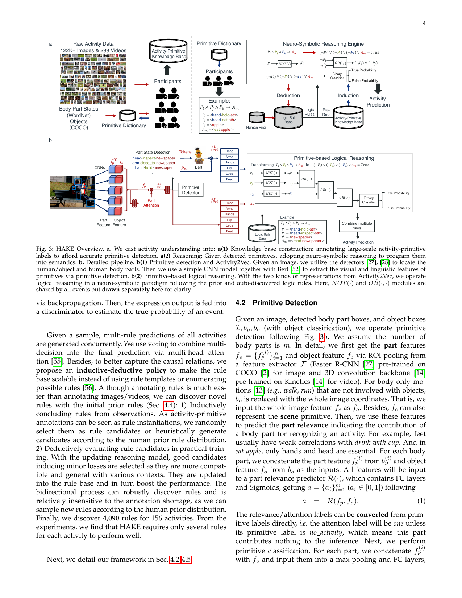

# 问题

大模型能认猫认狗，为什么认不好人在干什么?

物体识别已经做到 55+ mAP,但活动识别在同等数据量下只能到 20 出头就卡住了。作者做了个实验:让人在图里框出"去掉这块就认不出来"的最小区域。披萨这个物体,关键区域占边界框的 93.7%;但"吃披萨"这个动作,关键区域只占 15.3%——剩下全是干扰。物体是密集的语义块,活动是稀疏的线索散落在画面里。直接从像素映射到语义,对物体管用,对活动不灵。

之前的方法都在拼命喂数据、堆网络,但瓶颈不在这儿。作者回头看人怎么认活动:先抓局部线索(手在握东西、头在看报纸、有个杯子),再把这些小块拼起来推理("握+看+报纸"→读报)。这些小块能跨活动复用,叫"原子动作"(primitive)。HAKE 就是把这条路工程化:先建个知识库,标出 2640 万个原子动作;再训练一个推理引擎,用逻辑规则把原子拼成活动。

# 翻译



想象你在看监控录像,要判断画面里的人在干什么。传统方法是把整张图扔进神经网络,让它直接吐出"骑自行车"或"读报纸"。但这招对活动不灵——因为活动的关键信息太散了。

HAKE 换了个思路:把识别拆成两步走。

## 第一步:把画面拆成可复用的小零件

不直接认活动,先认"身体部位在干什么"。比如:
- 手的状态:握着、推着、捏着、穿着
- 脚的状态:踩着、站着、跳着
- 头的状态:看着、吃着、读着

再加上物体(杯子、报纸、自行车)和场景(教室、客厅)。这些小零件叫"原子动作"(primitive)。

作者找了 702 个人,标了 35.7 万张图和视频帧,覆盖 156 种活动。最后攒出 2640 万个原子动作标签。标完发现:常用的原子动作其实就一百来种,能组合出绝大多数日常活动。

训练一个检测器专门认这些原子动作。在 HICO-DET 数据集上,给定人和物体的框,原子检测能到 42.2 mAP——比直接认活动(19.4 mAP)高一倍多。

## 第二步:用逻辑规则把零件拼成活动

检测出原子动作后,怎么推出最终活动?用逻辑规则。

比如"读报纸"这个活动,规则可能是:
```
头-读-某物 ∧ 手-握-某物 ∧ 报纸 → 读报纸
```

三个原子同时出现,就推出"读报纸"。

规则从哪来?一开始让标注者写(人类先验)。比如问"你怎么判断一个人在读报纸?",标注者会说"手拿着报纸,头在看"。每个活动收集多条规则,保证多样性。

但人写的规则不一定完美。比如"骑自行车",标注者可能写"脚踩踏板 ∧ 臀部坐座位 ∧ 手握把手"。但实际场景里,有人骑车时双手离把、有人站着骑、有人跳着骑。这些边角情况靠人很难穷举。

所以 HAKE 加了个自动发现机制:训练时不断评估规则,表现好的留下,表现差的换掉。同时自动生成新规则候选,看能不能更好地解释数据。这样就能发现那些"站着骑车""跳着骑车"的规则。

逻辑推理用神经网络实现:把 NOT、OR 这些逻辑操作变成可微分的 MLP 模块,加上逻辑定律作为优化约束(比如 x ∨ ¬x = True)。这样整个系统端到端可训练。

## 效果如何

在 HICO-DET 数据集上,把 HAKE 插到现有方法里:
- TIN 方法从 17.0 提到 23.2 (+36%),稀有类从 13.4 提到 23.2 (+73%)
- VCL 方法从 23.6 提到 28.3 (+20%)
- QPIC 方法从 29.1 提到 32.1 (+10%)

在 AVA 视频数据集上:
- LFB 方法从 23.9 提到 26.8 (+12%)
- SlowFast 方法从 28.2 提到 29.3 (+4%)

迁移学习更明显。在 V-COCO 数据集上,TIN 从 54.2 提到 59.7。在 Ambiguous-HOI(专门考察姿态歧义)上,从 8.2 提到 10.6 (+29%)。

如果用真实标注的原子动作(不靠检测器),性能能到 62.7 mAP。如果再加上百万规则搜索,能到 71.7 mAP——远超当前最好方法的 29 mAP。这说明思路本身天花板很高,瓶颈在原子检测和规则质量。

# 核心概念

## 原子动作 (Primitive)

活动识别里最小的、可复用的语义单元。

想象乐高积木。你不会为每个成品单独开模——用几十种基础块就能拼出无数造型。原子动作就是活动识别的基础块。

HAKE 的原子动作包括三类:
1. **身体部位状态** (PaSta): 手-握-某物、脚-踩-某物、头-看-某物。标注格式是"部位-动词-对象"。虽然理论上组合很多,但常用的就一百来种。
2. **物体**: 杯子、报纸、自行车。直接用 COCO 的 80 类物体。
3. **场景**: 教室、客厅。用 Places 的 400 类场景。

为什么重要? 因为它解决了活动识别的两个死穴:
- **稀疏性**: 活动的关键信息散落在画面各处,原子动作让模型只关注这些关键区域,等效提高了语义密度。
- **泛化性**: 原子动作跨活动复用。"手-握-某物"在"骑车""读报""喝水"里都出现,学一次能用很多次。这就是为什么 HAKE 在迁移学习上表现好——新活动往往是已知原子的新组合。

## 逻辑规则 (Logic Rule)

把原子动作组合成活动的因果关系。

形式是 `P1 ∧ P2 ∧ P3 → A`,意思是"当原子 P1、P2、P3 同时出现,推出活动 A"。

比如"扔飞盘":
```
头-看-某物 ∧ 手-扔-某物 ∧ 腿-弯曲 ∧ 飞盘 → 扔飞盘
```

规则不是硬编码的 if-else,而是可学习的。用神经网络实现 NOT 和 OR 操作,加上逻辑定律作为约束(比如 x ∨ ¬x 必须为真)。训练时不断评估规则表现,好的留下,差的换掉,还能自动生成新规则候选。

为什么不直接让神经网络端到端学? 因为逻辑规则带来两个好处:
- **可解释性**: 能看到模型为什么判断这是"读报纸"——因为检测到了"手-握-某物""头-读-某物""报纸"这三个原子。
- **组合泛化**: 见过"手-握-杯子"和"头-喝-某物",就能推出"喝咖啡",即使训练时没见过这个组合。纯神经网络很难做到这点。

## 语义覆盖率 (SCR, Semantic Coverage Rate)

衡量图像中关键语义区域占比的指标。

测量方法:让人在图里涂掉最小的区域,使得其他人认不出这是什么物体或活动。涂掉的区域占边界框的比例就是 SCR。

物体的 SCR 高(披萨 93.7%),活动的 SCR 低(吃披萨 15.3%)。这解释了为什么物体识别能用直接映射做到 55+ mAP,而活动识别卡在 20 出头——活动的有效信息太稀疏,大部分像素是干扰。

HAKE 通过原子检测,等效提高了 SCR。模型不看整张图,只看检测出的原子区域,相当于自动过滤掉了无关像素。

# 洞见

活动识别难,不是因为网络不够深、数据不够多,而是因为标签层次太高——直接从像素跳到"骑自行车"这种高层语义,中间缺了可复用的中间表示。

先把活动拆成可复用的原子,再做组合推理,数据才能越学越值钱。标一次"手-握-某物",能用在一百个活动里;标一次"骑自行车",只能用在这一个活动里。

# 博导审稿

**选题眼光**: 问题抓得准。活动识别确实卡在瓶颈上,作者用 SCR 这个指标把"为什么难"说清楚了,比泛泛说"活动比物体复杂"有力。原子动作这个中间表示也不是拍脑袋,有认知科学支撑(System 1/2, EBA 脑区)。

**方法成熟度**: 工程量大,但不够优雅。标了 2640 万个原子动作,这是苦力活,不是巧活。逻辑推理那部分,说是"符号推理",其实还是神经网络近似——NOT 和 OR 是 MLP 实现的,只是加了逻辑定律作为正则项。离真正的符号推理(离散、可验证、可组合)还有距离。规则更新机制也是启发式的,没有理论保证。

**实验诚意**: 数据集够全(HICO-DET、AVA、V-COCO、Ambiguous-HOI),消融够细(语言特征、规则复杂度、更新策略)。但有个问题:在强 baseline 上提升有限(QPIC 只提了 10%),主要提升在弱 baseline 和稀有类上。这说明 HAKE 更像是"补短板"而不是"拔尖"。

**写作功力**: 结构清晰,动机讲得透。但有些地方过度包装——把神经网络实现的逻辑操作说成"neural-symbolic reasoning",容易让人以为是真符号系统。SCR 测试那部分(让 HAKE 和人类都去涂图)挺有创意,但放在论文里略显凑数,核心还是看检测和推理性能。

**判决**: weak accept。问题真,数据真大,思路新,但逻辑那部分更像有约束的神经模块,还没到干净利落的符号推理。上限实验(GT 原子 + 百万规则搜索能到 71.7 mAP)很诱人,但也暴露了当前系统离上限还远——原子检测和规则质量都是瓶颈。如果后续工作能把这两块做扎实,这条路是通的。

# 启发

**迁移**: 原子动作这个思路能移植到其他需要"稀疏线索组合推理"的任务上。比如医学影像诊断——病灶往往是局部的小区域,可以先检测"原子病征"(钙化点、结节、血管异常),再用规则组合推出疾病。比端到端分类更可解释,也更容易迁移到新病种。

**混搭**: HAKE 的逻辑推理模块可以和因果推断结合。现在的规则是关联性的(P1 ∧ P2 → A),但如果能建模反事实(如果没有 P1 会怎样?),就能回答"哪个原子是这个活动的必要条件"。这对机器人很有用——知道"手-握-把手"对"骑车"不是必要的(可以站着骑),就不会在规划时过度约束。

**反转**: 论文里"先检测后推理"的两阶段范式,和当前端到端大模型的趋势是反着的。但这提醒我们:不是所有任务都适合端到端。当标注稀缺、需要泛化、需要可解释时,显式的中间表示和符号推理仍然有价值。可以考虑在自己的系统里,哪些模块适合"拆开来、显式建模",而不是全扔给一个黑盒。

